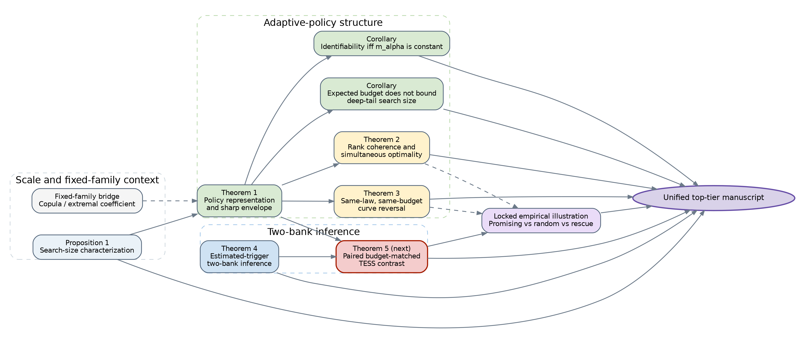

# Top-Tier Manuscript Architecture v1

## Policy-Level Search Size for Adaptive Statistical Pipelines

**Strategic status:** Post-D2 integration review
**Date:** 2 August 2026
**Theory branch:** `tess-top-tier-theory`
**Current theory head:** `38daf14` (`tess-theory-work-package-d2-v1-results-final-20260802`)
**Fallback empirical branch:** `ess-study`
**Purpose:** Decide the scientific identity, theorem spine, journal route, manuscript structure, and minimum remaining work before drafting a top-tier submission.

---

# 1. Executive decision

## 1.1 Overall judgment

The project has crossed the threshold from a strong applied-methodology paper to a credible foundational statistics paper.

The reason is **not** the logarithmic TESS formula by itself. The viable foundational claim is:

> **Fixed candidate laws and expected candidate-count budgets do not determine the inferential burden of an adaptive policy. The missing object is the threshold-indexed coupling between the policy's branching rule and its counterfactual incremental rejection opportunities.**

Work Packages A and B supply the structural theory. Work Packages D1 and D2 supply regular two-bank inference. The locked confirmatory study supplies a nontrivial empirical phenomenon that the theory explains rather than merely illustrates.

## 1.2 Recommended publication strategy

1. **Prepare one theory-first manuscript.** It should supersede, not merely append to, the current empirical v2 draft.
2. **Retain empirical v2 as a frozen fallback.** Do not submit the theory paper and the current empirical TESS paper as overlapping separate publications.
3. **First target: Biometrika, regular paper**, provided the main paper can remain under 20 pages and the theorem scope is tightened as specified below.
4. **Second target: JRSS-B**, if the paper needs more space for methodology, application scope, and the locked empirical illustration.
5. **JASA Theory and Methods** becomes especially attractive if a uniform process theorem, software implementation, or a broader inference package is added.
6. **Annals of Statistics is not the immediate target.** It becomes realistic only if a substantially more general process theory or policy-class result becomes the central contribution.

## 1.3 Next theorem decision

**Develop D4, the paired budget-matched policy-contrast theorem, before D3.**

D4 directly connects the sharp allocation theory to the locked promising-minus-matched-random estimand. It is the smallest missing theorem that closes the conceptual and inferential loop of the paper.

D3, a uniform TESS-process theorem and simultaneous bands, remains valuable but should be attempted only after a complete manuscript draft shows that it is necessary for the target journal.

---

# 2. Scientific identity of the paper

## 2.1 Recommended title

### Preferred

**Inferential Search Size of Adaptive Statistical Policies**

### Strong alternative

**Search Size Is a Property of the Adaptive Policy**

### More descriptive alternative

**Policy-Level Search Size under Adaptive Statistical Branching**

Avoid putting “TESS” in the title. The acronym is useful inside the paper, but the foundational object is policy-level search size, not a branded formula.

## 2.2 One-sentence paper claim

> Two adaptive policies can share the complete fixed candidate law, marginal inclusion probabilities, candidate-count distribution, and expected candidate cost, yet have different global-null rejection curves; policy-level search size is determined by how activation is coupled to threshold-specific incremental rejection.

## 2.3 Abstract-level contribution statement

The final abstract should communicate four layers, in this order:

1. **Non-identifiability:** fixed-family dependence and budget summaries are insufficient.
2. **Sharp policy calculus:** the policy rejection law is generated by the coupling between activation and conditional incremental rejection; sharp same-budget envelopes follow.
3. **Threshold structure:** a common activation ordering is uniformly optimal only under rank coherence; otherwise policy curves can reverse.
4. **Inference and evidence:** reference- and evaluation-bank uncertainty admit a two-bank expansion and bootstrap; a locked machine-learning experiment demonstrates the phenomenon.

## 2.4 What the paper is not

- not the first effective-number-of-tests formula;
- not a new extremal coefficient;
- not a universal multiplicity correction;
- not a claim that every adaptive procedure is harmful;
- not a replacement for exact pipeline-aware max-statistic inference;
- not primarily a clinical prediction paper;
- not a paper whose novelty rests on a covariance identity alone.

---

# 3. Source and evidence hierarchy

## 3.1 Frozen theoretical sources

| Component | Frozen source | Status in final paper |
|---|---|---|
| Axiomatic characterization and fixed-family copula bridge | Theory memo v1 | Short supporting proposition/remark |
| Sharp policy representation and envelope | Work Package A | Central theorem |
| Identifiability and fixed-budget impossibility | Work Package A | Central corollaries/theorem |
| Cost-weighted allocation | Work Package A | Supplement |
| Threshold-rank coherence | Work Package B | Main theorem after proof audit |
| Full-curve stochastic dominance | Work Package B | Supplement or corollary |
| Arbitrary policy-curve crossings | Work Package B | Main counterexample after scope repair |
| Known-trigger two-bank inference | D1 | Supplementary stepping stone; REVIEW retained |
| Estimated-trigger two-bank inference | D2 | Main inference theorem; PASS |
| Conditional DKW bands | Theory memo v1 | Supplementary rigorous baseline |

## 3.2 Frozen empirical sources

| Evidence | Role |
|---|---|
| Fresh-seed locked confirmatory study | Main empirical illustration |
| Promising vs budget-matched random primary contrast | Main result |
| Rescue policy, high-dependency library, alpha curves | Secondary empirical structure |
| Reference-bank uncertainty sensitivity | Supports the need for two-bank inference |
| SUPPORT2-anchored permutation experiment | Supplementary structural validation |
| Reconstruction, tie, failed-fit, archive, and hash audits | Reproducibility supplement |

## 3.3 Evidence hierarchy in the final paper

1. General theory and impossibility results.
2. Regular two-bank estimation and bootstrap theory.
3. Locked confirmatory empirical illustration.
4. SUPPORT2-anchored and other supplementary checks.

This is the reverse of the current empirical v2 narrative. The top-tier paper must be theory-first.

---

# 4. Theorem audit and maturity map

## 4.1 Green: ready for manuscript-level proof polishing

| Result | Why it is ready | Main/supplement |
|---|---|---|
| Independent-composition characterization | Correct, concise Cauchy-equation argument; novelty modest but role clear | Main, short |
| Fixed-family copula/extremal-coefficient representation | Correct bridge to prior art | Main remark or supplement |
| Policy representation `pi_a = pi_0 + E(a m_alpha)` | Fundamental and transparent | Main |
| Sharp same-rate envelope | Standard rearrangement applied to a new policy functional | Main |
| Identifiability iff `m_alpha(S)` is constant | Sharp and central | Main |
| Fixed expected candidate count does not bound deep-tail search size | Striking impossibility result | Main |
| D2 two-bank linear expansion | Regular empirical-process/quantile theorem, numerically validated | Main |
| D2 complete-vector bootstrap validity | Direct practical consequence, numerically validated | Main |
| Exact finite-reference expectation in the independent benchmark | Explains D1 finite-B behavior | Supplement |

## 4.2 Amber: retain, but complete a formal proof/scope audit before final drafting

| Result | Issue to resolve | Required action |
|---|---|---|
| Rank-coherence/common-rank theorem | Uncountable threshold index requires a common version, separability, or a finite/dense-index formulation | State on compact separable `I`, add measurability/version conditions, or first state for finite threshold sets |
| Arbitrary smooth curve-crossing theorem | Current construction is naturally a branch-output selection policy; it must not be silently described as nested candidate addition | Rephrase as general adaptive branch selection, or rebuild a nested-expansion construction |
| Multistage telescoping extension | Correct algebraically but peripheral and likely to invite scope expansion | Move to a remark/supplement |
| Weighted compromise objective | Useful but secondary | Supplement |
| Trigger-only variance diagnostic | Ratio is unstable when the theoretical denominator is near zero | Report absolute contribution, not ratio, in any final table |

## 4.3 Red: missing bridge results required before submission

1. **D4 paired policy-contrast theorem.**
2. **Exact plus-one/order-statistic bridge.**
3. **Finite-candidate unique-winner extension or an explicit statement that the inference theorem is a regular surrogate model.**
4. **A final literature novelty audit specifically targeting adaptive subset evaluation and selected-family search-cost functionals.**

---

# 5. Recommended theorem spine

The main paper should contain a small number of named results. Supporting algebra and secondary extensions move to the supplement.

## Proposition 1. Characterization of the search-size scale

At fixed local threshold `alpha`, null-law invariance, continuity, independent-union additivity, and exact-single normalization uniquely give

`S_A(alpha) = log{1 - pi_A(alpha)} / log(1 - alpha)`.

**Role:** justifies the scale.
**Novelty claim:** supporting, not central.

## Remark 1. Fixed-family limit

For a fixed family of exact p-values, search size is the diagonal log-ratio of the survival copula; under extreme-value dependence it equals the extremal coefficient.

**Role:** locates the new object relative to known effective-number theory.
**Placement:** no more than half a page in the main text.

## Theorem 1. Policy representation and sharp same-budget envelope

For activation-time information `S`, activation kernel `a(S)`, and incremental rejection `D_alpha`, define

`m_alpha(S) = E(D_alpha | S)`.

Then

`pi_a(alpha) = pi_0(alpha) + E{a(S)m_alpha(S)}`,

and at fixed activation rate `r`, the attainable rejection probabilities are exactly the lower and upper integrated-quantile envelope of `m_alpha(S)`.

**Role:** central representation theorem.

## Corollary 1. Exact policy identifiability criterion

The fixed candidate law and activation rate identify policy rejection burden if and only if `m_alpha(S)` is almost surely constant.

**Role:** central conceptual claim.

## Corollary 2. Budget insufficiency

Expected candidate count alone does not upper-bound deep-tail policy search size. At a fixed expected candidate-count budget, the deep-tail search size may diverge as the optional family grows.

**Role:** memorable impossibility result.

## Theorem 2. Threshold coherence and simultaneous optimality

Under a formally audited rank-coherence condition, a common rank variable orders `m_alpha(S)` for all `alpha` in the declared interval; top-rank activation is simultaneously optimal throughout the interval.

**Role:** explains when one scalar trigger can be uniformly meaningful.

## Theorem 3. Threshold-dependent non-orderability

Without rank coherence, policies with the same fixed branch law and the same budget can have crossing rejection and search-size curves. A smooth construction can place prescribed finite crossing points.

**Role:** curve-level impossibility result.
**Scope warning:** describe it as a general branch-output policy unless a nested-expansion construction is supplied.

## Theorem 4. Estimated-trigger two-bank inference

Under the regular one-candidate-per-branch model, jointly estimating base, optional, and trigger quantiles from a complete-vector reference bank gives

`pi_hat - pi = P_n phi_E + P_B phi_R + o_p(n^-1/2 + B^-1/2)`,

with

`phi_R = a_0 W_0 + b_1 W_1 + d_U W_U`,

and a valid independently resampled complete-replication two-bank bootstrap. The TESS result follows by the delta method.

**Role:** main inference theorem.

## Theorem 5. Paired budget-matched policy contrast - D4, to be completed

This theorem should target the empirical mechanism directly.

Let

- `e_0 = E(R_0)`,
- `r = E(A)`,
- `mu = E(D)`,
- `nu = E(AD)`.

Then

- adaptive-policy rejection: `pi_A = e_0 + nu`,
- budget-matched random rejection: `pi_C = e_0 + r mu`,
- allocation premium: `delta = nu - r mu = Cov(A,D)`,
- TESS contrast: `Delta_S = g_alpha(pi_A) - g_alpha(pi_C)`.

The evaluation influence function has the explicit form

`phi_E^Delta = g'(pi_A){R_0 + AD - pi_A}`

`             - g'(pi_C){(R_0-e_0) + mu(A-r) + r(D-mu)}`.

The reference contribution is the gradient of `Delta_S` with respect to the reference-calibrated policy parameters multiplied by their joint reference influence function. A paired complete-replication two-bank bootstrap should consistently estimate the contrast law.

**Role:** closes the loop between Work Package A, D2, and the locked primary estimand.

---

## Theorem dependency map

{width=98%}

The red node is the single recommended new theorem before full manuscript drafting.

---

# 6. Why D4 should precede D3

| Criterion | D4: paired policy contrast | D3: uniform process/bands |
|---|---|---|
| Direct match to locked primary estimand | Excellent | Indirect |
| Connects structural and inferential theory | Excellent | Moderate |
| Likely technical difficulty | Moderate | High |
| Required for Biometrika viability | Strongly desirable | No |
| Required for JRSS-B viability | Desirable | Helpful |
| Required for JASA-level inference package | Desirable | Strongly desirable |
| Risk of delaying manuscript indefinitely | Lower | Higher |
| Manuscript page cost | Low-moderate | High |

**Decision:** develop and validate D4. Draft the complete paper. Reassess D3 only after the draft exists.

D3 should be added only if one of the following becomes true:

1. editors/reviewers are likely to view fixed-threshold inference as incomplete;
2. the paper is targeted to JASA with inference as a coequal contribution;
3. a concise process theorem follows with little additional notation;
4. simultaneous curve bands materially improve the empirical analysis.

---

# 7. Main-paper architecture for a Biometrika-first submission

## 7.1 Target length

Biometrika regular papers are normally fewer than 20 pages. The proposed main text should target **17-19 typeset pages including references, figures, and tables**, with full proofs and validation details in a separate supplement.

## 7.2 Section plan and page budget

| Section | Purpose | Target pages |
|---|---|---:|
| Abstract | Non-identifiability, sharp calculus, two-bank inference, locked illustration | 0.4 |
| 1. Introduction | State the missing policy layer; distinguish fixed-family work | 1.6-1.9 |
| 2. Search-size functional | Definition, characterization, fixed-family bridge | 1.2-1.5 |
| 3. Adaptive policy calculus | Representation, envelope, identifiability, budget impossibility | 3.0-3.4 |
| 4. Threshold ordering | Coherence, common trigger, crossing counterexample | 2.2-2.6 |
| 5. Two-bank inference | D2 and D4 statements, interpretation, bootstrap | 2.6-3.0 |
| 6. Locked illustration | One compact confirmatory example; no full methods dump | 2.0-2.4 |
| 7. Discussion | Meaning, scope, error-control distinction, limitations | 1.2-1.5 |
| References | Core references only | 2.0-2.5 |
| **Total** |  | **15.8-18.8** |

## 7.3 Detailed section outline

### 1. Introduction

Paragraph 1: adaptive statistical development creates state-dependent candidate sets.
Paragraph 2: fixed-family effective-number, data-snooping, post-selection, and adaptive-testing literatures do not identify the burden of a declared branching policy.
Paragraph 3: same budget does not imply same rejection law.
Paragraph 4: contributions, stated without introducing every theorem.
Paragraph 5: locked empirical illustration and paper map.

### 2. Policy-level search size

2.1 Policy rejection curve and exact/super-uniform distinction.
2.2 Independent-composition characterization.
2.3 Fixed-family copula/extremal-coefficient bridge and explicit prior-art boundary.

### 3. Adaptive policy calculus

3.1 Counterfactual base/full rejection and activation information.
3.2 Representation theorem.
3.3 Sharp same-rate envelope.
3.4 Identifiability criterion.
3.5 Fixed expected-budget impossibility result.
A one-paragraph cost-weighted remark may point to the supplement.

### 4. Threshold coherence and reversal

4.1 Rank coherence and common-index simultaneous optimality.
4.2 Why a score optimal at alpha = 0.05 need not be optimal elsewhere.
4.3 One decisive curve-crossing construction.
Move FOSD, weighted compromise, multiple-crossing algebra, and regret to the supplement.

### 5. Two-bank estimation and policy contrasts

5.1 Population, conditional finite-reference, and unconditional two-bank targets.
5.2 D2 estimated-trigger linear expansion.
5.3 Complete-vector bootstrap.
5.4 D4 paired matched-budget contrast.
5.5 Finite-reference bias and exact plus-one bridge, summarized briefly.

### 6. Locked machine-learning illustration

6.1 Design in one compact paragraph.
6.2 Primary promising-minus-random result.
6.3 Rescue reversal and high- versus mixed-dependency comparison.
6.4 Mechanism: signed gain/loss decomposition and threshold coherence diagnostic.
6.5 Two-bank sensitivity.
SUPPORT2 moves to the supplement, with one sentence in the main text.

### 7. Discussion

- policy multiplicity is a coupling property;
- expected search budget is not an upper bound;
- threshold ordering is not automatic;
- TESS is diagnostic, while exact pipeline-aware inference controls error;
- regular inference theorem versus exact winner-selection pipeline;
- implications for reporting adaptive development policies;
- limitations and extensions.

---

# 8. Main figures and tables

## Figure 1. The missing policy layer

A new conceptual figure, replacing the current workflow-only Figure 1.

Three columns:

1. **Fixed candidate law:** candidate scores/p-values and dependence.
2. **Adaptive policy layer:** activation information and kernel `a(S)`.
3. **Policy rejection law:** `pi_a = pi_0 + E(a m_alpha)` and search-size curve.

The figure should visually show that candidate law + budget is insufficient without the coupling.

## Figure 2. Sharp same-budget envelope and budget impossibility

Panel A: lower/random/upper attainable rejection or TESS at fixed activation rate.
Panel B: fixed expected candidate count with deep-tail search size increasing with optional-family size.

## Figure 3. Coherence versus reversal

Panel A: common-index ordering (top > random > bottom) over the full curve.
Panel B: same-law, same-budget policies whose curves cross at a prescribed threshold.

## Figure 4. Locked empirical illustration

A compact composite:

- Panel A: promising and rescue TESS contrasts in high-dependency, mixed-realistic, and SUPPORT2 structures.
- Panel B: signed mechanism contribution or `Cov(A,D_alpha)` over alpha.

Existing detailed fixed-search curves, score-decile plots, and SUPPORT2 curves move to the supplement.

## Table 1. Theorem map and assumptions

Columns: result, policy class, threshold scope, reference calibration, main assumptions, novelty role.

## Table 2. Locked empirical results

Only the central contrasts, covariance, activation rate, gain/loss capture, and two-bank sensitivity.

---

# 9. Supplementary architecture

## Supplement A. Complete proofs

- axiomatic characterization;
- sharp envelope and identifiability;
- unbounded budget mismatch;
- rank coherence and crossing results;
- cost-weighted allocation and stochastic dominance;
- D2 and D4 proof details.

## Supplement B. Inference extensions

- D1 known-trigger derivation and REVIEW adjudication;
- D2 estimated-trigger derivation and PASS validation;
- exact finite-B expectation;
- conditional DKW bands;
- plus-one/order-statistic bridge;
- finite-candidate unique-winner extension;
- optional D3 process theorem if completed.

## Supplement C. Numerical validation

- D1 and D2 locked protocols;
- DGP definitions;
- all cell summaries and diagnostics;
- explanation of basic interval undercoverage;
- trigger-only near-zero-denominator diagnostic.

## Supplement D. Locked empirical study

- full simulation engine and candidate manifests;
- all policy definitions and tie rules;
- confirmatory and SUPPORT2 protocols;
- complete results tables;
- reconstruction and failed-fit audits;
- figure set currently in the empirical manuscript;
- raw archive and Git provenance.

## Supplement E. Reproducibility

- software versions;
- repository and DOI;
- configuration SHA-256 values;
- tags and commits;
- AI assistance disclosure;
- data and code availability.

---

# 10. Mandatory bridge work before drafting the final manuscript

## 10.1 D4 paired contrast

Complete theory, code, locked numerical protocol, scientific validation, and results freeze.

## 10.2 Exact plus-one/order-statistic lemma

Derive the exact event equivalence for

`p_hat_j(x) = {1 + sum I(T_bj >= x)}/(B+1)`

under the strict rule `p_hat_j(x) < alpha`, including:

- the integer rounding convention;
- continuous-score no-tie form;
- relation to an empirical upper quantile;
- the first-order equivalence regime;
- the grid/deep-tail regime in which discreteness remains first-order.

This bridge is necessary because the empirical application uses plus-one p-values, whereas D2 uses regular empirical quantiles.

## 10.3 Scope repair for the curve-crossing construction

Choose one of two honest routes:

1. **General branch-policy route:** state the theorem for a policy that selects between branch outputs; make clear that it proves non-orderability for general adaptive policies, not specifically nested candidate addition.
2. **Nested-expansion route:** construct the same crossing phenomenon with base/full counterfactual outputs arising from a nested candidate family.

Do not leave the scope implicit.

## 10.4 Proof audit of rank coherence

- specify whether `I` is finite, countable dense, or compact with separable versions;
- identify a common probability-one set;
- handle atoms through explicit boundary randomization;
- separate equivalence for all activation rates from statements at one rate.

## 10.5 Frozen-output empirical extraction

No model refitting is required. Extract and report:

1. loss counts `D_alpha = -1`;
2. loss-capture fractions;
3. positive and negative covariance contributions;
4. exact mixed-minus-high interaction and CI;
5. exact SUPPORT2 rescue CI;
6. estimated `m_alpha(S)` on a common score-bin grid;
7. rank correlations of the estimated fields across alpha;
8. FOSD diagnostics for promising/random/rescue activation scores;
9. observed curve crossings and simultaneous regret relative to the empirical pointwise envelope.

---

# 11. Overlap and publication-integrity guardrails

## 11.1 Relationship to the companion pipeline-aware inference paper

The distinction must be explicit in the introduction, discussion, cover letter, and repository README.

| Companion pipeline-aware inference paper | Policy search-size paper |
|---|---|
| Provides valid search-adjusted max-statistic inference | Describes and estimates the naive policy-level global-null rejection burden |
| Primary object is an adjusted p-value/test | Primary object is a rejection-law functional and its search-size standardization |
| Re-executes the complete pipeline under the null | Studies how policy structure and calibration determine the burden |
| Goal is error control | Goal is measurement, structural understanding, and policy comparison |

## 11.2 Relationship to empirical v2

The top-tier manuscript should absorb the key empirical evidence. The current empirical v2 remains a fallback, not a simultaneously submitted separate manuscript.

If the top-tier paper is abandoned, return to empirical v2. If the top-tier paper is submitted, do not submit empirical v2 unless it is later redesigned around a substantively distinct clinical/application question with nonoverlapping claims and figures.

---

# 12. Literature positioning and wording guardrails

## 12.1 Main prior-art clusters

- fixed-family effective numbers and Sidak/copula calibration;
- extremal coefficients and level-dependent tail dependence;
- data snooping and best-model bootstrap tests;
- search degrees of freedom;
- post-selection inference;
- adaptive data analysis;
- interactive, online, and learn-then-test procedures;
- selected-family and hierarchical multiple testing;
- empirical-process and two-sample bootstrap theory.

## 12.2 Safe novelty language

Use:

- “policy-level rejection functional”;
- “sharp same-budget envelope”;
- “policy non-identifiability from fixed-family and budget summaries”;
- “threshold-rank coherence”;
- “complete-replication two-bank inference”;
- “locked empirical illustration.”

Avoid:

- “the first effective number of tests”;
- “a new extremal coefficient”;
- “the first treatment of adaptive multiplicity”;
- “universal search complexity”;
- “TESS corrects multiplicity”;
- “D2 proves validity for the exact 20-candidate pipeline.”

## 12.3 Recommended narrow novelty paragraph

> Fixed-family effective-number and extremal-coefficient methods describe the tail geometry of a declared family of statistics. They do not identify the rejection law of a policy whose evaluated family depends on intermediate data. We characterize the missing policy layer through conditional incremental rejection, derive sharp same-budget envelopes and identifiability conditions, show that identical fixed candidate laws and budgets permit different or crossing policy rejection curves, and develop two-bank inference when the policy calibration is estimated from an independent reference sample.

---

# 13. Reviewer-risk register

| Risk | Severity | Response before submission |
|---|---|---|
| “TESS is just a Sidak inversion” | High | Make it a short characterized scale; center novelty on policy non-identifiability and envelopes |
| Curve-crossing theorem scope does not match nested expansion | High | Repair scope or construction before drafting |
| D2 is only a simplified two-candidate regular model | High | Add plus-one bridge, D4, and explicit limitation; never overclaim exact-pipeline validity |
| Too many theorems for one concise paper | High | Use the main theorem spine above; move cost/FOSD/D1/full validation to supplement |
| Empirical and theory papers appear duplicative | High | Submit one unified top-tier paper; freeze empirical v2 as fallback |
| Rank-coherence proof over uncountable alpha is informal | Medium-high | Add separability/version conditions or finite-grid theorem first |
| Expected-budget impossibility appears adversarial only | Medium | Pair theorem with locked heterogeneous-library phenomenon |
| D2 validation PASS depends on selecting B >= 3000 as main | Medium | Explain this was prospectively informed by frozen D1 and locked before D2 run |
| Single-author proof reliability | Medium | Obtain independent mathematical review before submission |
| Manuscript exceeds Biometrika length | Medium | Enforce page budget; place proofs and SUPPORT2 in supplement |
| Novelty search misses adjacent adaptive-subset literature | Medium | Perform a focused systematic novelty audit and citation chaining |

---

# 14. Journal route

## 14.1 Biometrika - recommended first submission

Best fit if the paper is concise and organized around:

- a foundational policy-level object;
- sharp non-identifiability/envelope results;
- unforeseen behavior under equal budgets;
- one compact inference theorem;
- one convincing locked illustration.

**Minimum before submission:** D4, plus-one bridge, scope repair, proof audit, and concise manuscript under 20 pages.

## 14.2 JRSS-B - recommended second route

Best fit if:

- the methodology and scope of application need more explanation;
- the locked empirical illustration remains substantial;
- D3 or broader computational implementation is included;
- the manuscript cannot honestly be compressed to Biometrika length.

A regular contributed paper is appropriate; it need not be a Discussion Paper.

## 14.3 JASA Theory and Methods

Best fit if:

- D3 supplies a uniform process and simultaneous bands;
- D4 is complete;
- software and a reusable policy-diagnostic workflow are part of the contribution;
- the paper is broader and more comprehensive than a concise Biometrika paper.

## 14.4 Annals of Statistics

Reconsider only if:

- inference is extended to a substantially more general policy class;
- process weak convergence and bootstrap validity are central rather than supplementary;
- winner selection or nonsmooth policy maps are handled nontrivially;
- the theoretical advance is likely to influence statistical methodology beyond this application.

---

# 15. Drafting sequence

1. Freeze this architecture and decision log.
2. Complete a proof audit of the green/amber theorem inventory.
3. Develop D4 under a separately locked protocol.
4. Derive and test the plus-one bridge.
5. Perform frozen-output signed-mechanism and coherence diagnostics.
6. Write a unified notation sheet and theorem dependency map.
7. Draft Sections 2-5 first.
8. Draft the empirical illustration from frozen outputs.
9. Draft Introduction and Discussion with the literature audit beside them.
10. Produce a Biometrika-length main PDF and a complete supplement.
11. Decide whether D3 is necessary only after the first complete typeset draft.
12. Obtain external mathematical review, then conduct a final citation and overlap audit.

---

# 16. Stop rules

Do not continue adding theory indefinitely.

Proceed without D3 if:

- D4 is complete;
- the plus-one bridge is satisfactory;
- the main theorem spine fits coherently under 20 pages;
- the locked illustration demonstrates the coupling mechanism;
- no major proof gap remains.

Attempt D3 only if it materially improves the paper's journal fit or closes an obvious inferential gap.

Return to empirical v2 if:

- the B-theorem scope cannot be repaired cleanly;
- D4 requires assumptions unrelated to the empirical policy;
- the unified main paper cannot be made concise;
- a focused literature audit finds that the central policy-envelope/non-identifiability result is already known in essentially the same form.

---

# 17. Immediate next action

The next work package should be:

> **Work Package D4: paired two-bank inference for the budget-matched policy TESS contrast.**

Before any D4 scientific run:

1. write a D4 theory/protocol memo;
2. define the population target and its plug-in estimator exactly;
3. decide whether the matched activation rate is population-defined, reference-estimated, or evaluation-estimated;
4. derive the joint evaluation and reference influence functions;
5. establish complete-replication paired bootstrap validity;
6. run runtime-only preflight;
7. lock the numerical protocol;
8. validate once and freeze the results.

No new large empirical model-fitting experiment is needed before D4.

---

# 18. Architecture decision log

| Decision | Choice | Rationale |
|---|---|---|
| Number of papers | One unified top-tier paper; empirical v2 frozen as fallback | Avoid overlap and keep theory tied to a real phenomenon |
| First journal | Biometrika | Best match to conceptual novelty, foundational structure, and concise anomalous behavior |
| Main next theorem | D4 paired contrast | Directly closes the empirical/theoretical loop |
| D3 timing | After first complete draft | Prevent open-ended theory expansion |
| Main empirical example | Locked mixed-realistic confirmatory study | Strongest prespecified evidence |
| SUPPORT2 placement | Supplement, brief main-text reference | Preserves realism without overwhelming theory |
| TESS formula role | Characterized standardization | Avoid false novelty claim |
| Copula/extremal coefficient | Prior-art bridge | Locates fixed-family special case |
| D1 status | REVIEW, retained | Honest record of finite-sample basic-interval limitations |
| D2 status | PASS | Meets D0 core success criterion |
| Winner/tie/plus-one claim | Not yet covered by D2 | Requires explicit bridge and scope statement |
